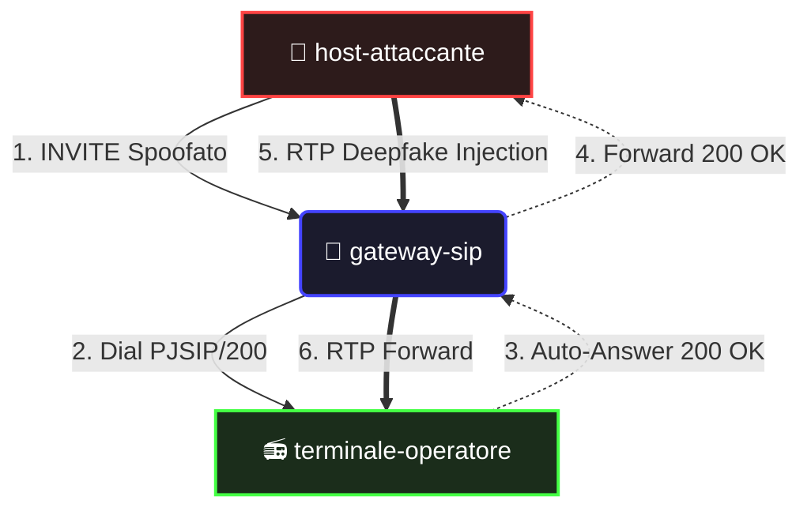

# 📖 Panic Engine POC — Guida Tecnica Completa

Questa guida illustra a 360 gradi l'ambiente di simulazione **Panic Engine**, sviluppato per validare l'iniezione di un deepfake audio (Dominio Cognitivo) tramite lo spoofing di comunicazioni SIP (Dominio Cyber) in una sandbox isolata. 

---

## 1. Architettura e Topologia di Rete

L'infrastruttura si basa su **Docker Compose** e crea un ambiente di rete isolato (`festival-net` con subnet `10.5.0.0/24`). Questa scelta garantisce che l'attacco rimanga confinato e non interagisca con le reti host o esterne.

L'ambiente è composto da **3 Container** paralleli:

1. 🏢 **`gateway-sip` (IP: 10.5.0.50)** — Il Target Logico
2. 📻 **`terminale-operatore` (IP: 10.5.0.200)** — La Vittima (Dominio Fisico/Informativo)
3. 🥷 **`host-attaccante` (IP: 10.5.0.99)** — Il Threat Actor



---

## 2. Anatomia dei Componenti

### A. Il Centralino Vulnerabile (`gateway-sip`)
Basato su **Alpine Linux e Asterisk 20 (stack PJSIP)**, simula il centralino PBX del centro operativo del festival. 
Contiene intenzionalmente due vulnerabilità (CWE) documentate in `pjsip.conf`:
- **CWE-862 (Missing Authorization):** Presenza di un endpoint di tipo `[anonymous]` che processa richieste in entrata da IP non riconosciuti.
- **CWE-287 (Improper Authentication):** L'endpoint non applica la `Digest Authentication` sulle chiamate in entrata e il trasporto UDP non forza la cifratura SIPS/TLS.

Nel `extensions.conf` (Dialplan), tutto il traffico proveniente dal contesto `from-external` viene instradato direttamente all'operatore (`Dial(PJSIP/200)`) senza controlli di sicurezza sull'identità.

### B. La Radio PoC della Vittima (`terminale-operatore`)
Simula un dispositivo radio "Push-to-Talk over Cellular" in dotazione allo staff dei varchi. Per massimizzare la stabilità headless in Docker, è stato implementato un **client SIP custom in Python**.
- Si autentica legittimamente sul gateway come utente `200` (`operatore123`).
- **Comportamento Chiave:** Implementa la funzione di **Auto-Answer**. Risponde automaticamente con un `200 OK` e un pacchetto SDP, aprendo il canale audio (RTP) senza l'interazione umana, simulando la forzatura del canale radio di terra.
- Stampa a schermo i log della ricezione chiamate, inclusi i metadati falsificati.

### C. L'Attaccante (`host-attaccante`)
Un ambiente Python minimale dotato di socket grezzi di rete. Lo script `/app/attack.py` modella l'attacco sulla *Unified Kill Chain*:
1. **Delivery (SIP Spoofing):** Invia un pacchetto UDP UDP RAW verso la porta 5060 di Asterisk. Questo pacchetto contiene un header `From:` falsificato: `"Burgemeester Jeroen Baert" <sip:mayor@comune.boom.be>`. L'obiettivo è l'Ingegneria Sociale (Autorità).
2. **C2 (Handshake SIP):** Gestisce asincronamente i pacchetti SIP di ritorno (`100 Trying`, `180 Ringing`, `200 OK`), effettuando il parsing del payload SDP del `200 OK` per capire su quale porta Asterisk aspetta il flusso audio.
3. **Impact (Media Injection):** Effettua un frammenting logico del file audio binario `deepfake_voice.wav` pacchettizzandolo dinamicamente con header **RTP** validi (Payload Type 0, G.711 µ-law, inviando 160 bytes ogni 20 millisecondi) per raggirare il sistema.

---

## 3. Come Lanciare e Controllare il POC

Tutte le operazioni sono state semplificate all'interno di un file `Makefile`. 
Apri un terminale (PowerShell o bash) nella cartella `centralino-tomorrowland` e utilizza i seguenti comandi.

> [!TIP]
> Se sei su Windows e non hai installato `make`, puoi tradurre i comandi `make <comando>` con i rispettivi comandi nativi Docker indicati di seguito.

### 🚀 Avvio dell'Infrastruttura
```bash
make up
# [In alternativa] docker-compose up -d --build
```
*Cosa fa:* Esegue il build delle immagini (scarica Alpine, compila l'ambiente) e avvia i 3 container in background.

### 🩺 Verifica dello Stato
```bash
make status
# [In alternativa] docker-compose ps
```
*Cosa fa:* Ti assicura che tutti i container siano in stato `Up`.

```bash
make check-endpoints
# [In alternativa] docker exec gateway-sip asterisk -rx "pjsip show endpoints"
```
*Cosa fa:* Mostra lo stato di Asterisk. Dovresti vedere l'endpoint `200` in stato **Not in use / Avail**.

---

## 4. Esecuzione dell'Attacco e Lettura dei Risultati

Per osservare a pieno l'attacco, è consigliato aprire **due terminali affiancati**.

### Terminale 1 (La Vittima)
Apri i log in tempo reale della radio dell'operatore:
```bash
make logs
# [In alternativa] docker logs -f terminale-operatore
```
*Vedrai il terminale che si è registrato correttamente ed è in attesa.*

### Terminale 2 (L'Attaccante)
Invia il payload d'attacco premendo il proverbiale "bottone rosso":
```bash
make attack
# [In alternativa] docker exec -it host-attaccante python /app/attack.py
```

### 🏆 Cosa osservare durante l'attacco

1. **Sul Terminale dell'Attaccante:** Vedrai scorrere le 3 Fasi. Prima il parsing del file audio `deepfake_voice.wav`, poi il pacchetto SIP grezzo che viene forgiato e inviato. Vedrai l'attesa del `200 OK` da parte di Asterisk, e infine un progress bar dello streaming RTP che pompa decine di pacchetti al secondo.
2. **Sul Terminale dell'Operatore:** Proprio mentre l'attaccante innesca la Fase 1, sul monitor della vittima apparirà:
   ```text
   ============================================================
     📞 INCOMING CALL
     Incoming call from: Burgemeester Jeroen Baert
     URI: sip:mayor@10.5.0.50
   ============================================================
   ```
   *Questa è la conferma visiva che l'Asterisk vulnerabile non ha validato il Caller ID e l'operatore è convinto di star parlando col Sindaco.*

### 🛡️ Post-Attacco: I Log del SOC (Blue Team)

Il POC è agganciato al controllo mitigativo **CTRL-C02** (Integrazione SIEM). 
Asterisk è stato programmato per esportare log di sicurezza standardizzati per strumenti come Wazuh.

Per vedere i log di sicurezza generati dall'attacco:
```bash
make siem
# [In alternativa] cat logs/security.log (su bash) o type logs\security.log (su PS)
```
Troverai entry che riportano anomalie di sessione e warning sull'uso dell'endpoint `anonymous`, fondamentali per permettere a un SIEM reale di triggerare regole di mitigazione automatizzata.

### 🧹 Spegnimento
```bash
make down
# [In alternativa] docker-compose down -v
```
Questo comando ferma tutti i container e distrugge la rete virtuale creata, lasciando il tuo ambiente pulito.
